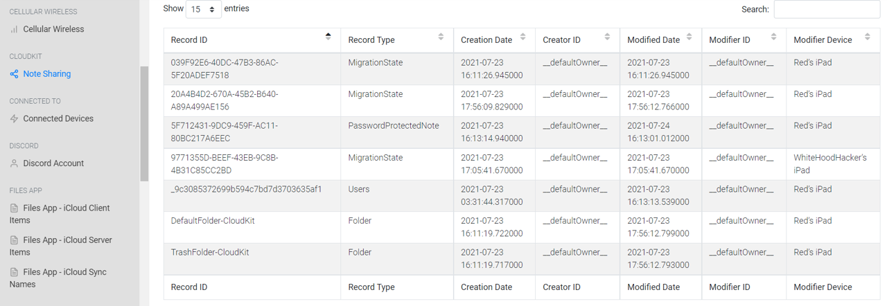
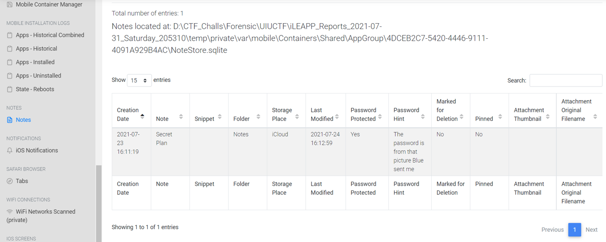
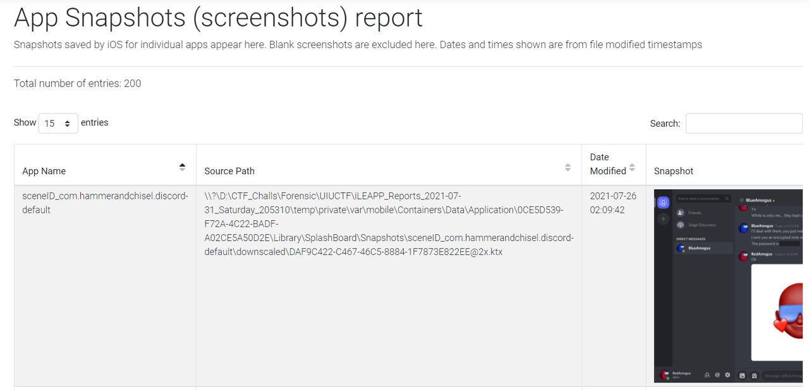
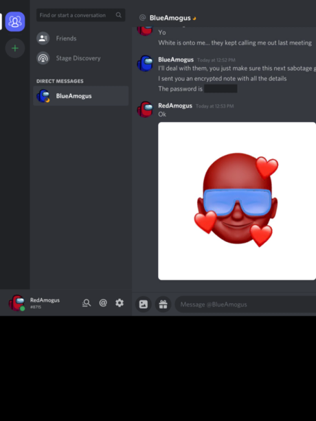
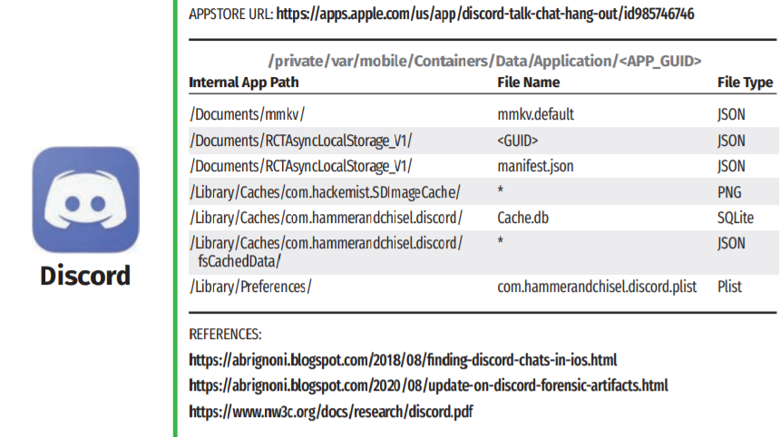
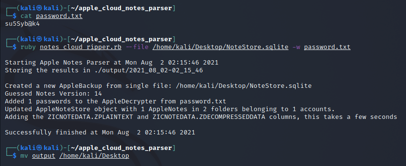
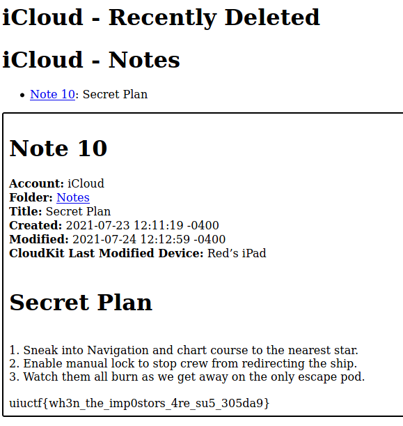

# Challenge Description


This challenge is part of the previous challenge, another `iOS Mobile Forensic` but there are hidden informations
that should be extracted and retrieved according to the description.

# Analysis

My hypotese:
* The perpetrator has some conversation with someone in iOS App
* There's a chance that the App is a `Third Party App`

We can use `iLEAPP` (https://github.com/abrignoni/iLEAPP) for further analysis. There are some keypoints of findings:


<br>

From the `CloudKits`, we indicate that there are 2 devices that were used and there's interesting thing to be further
analyzed, where `PasswordProtectedNote` record seems confidential to break.


<br>

Another artifact uncovers another hypotese before, where the first hypotese has been almost proved.
The conversations that "they" had contains confidential information, a password.
However, we still needs to know what platform do they use to interact each other (by `Chat`).

Looking to the `App Snapshots` which contains some `screenshots` of iOS Application, we see that `Red`
, as mentioned from the description, was having a conversation with `Blue` in `Discord` platform.
Our second hypotese is valid.


<br>

Unfortunately, the password itself was censored so even we took a screenshot of it, the password won't be
seen in plain.


<br>

Yet, it doesn't mean that we can't uncover the password. `iOS` saves all the application states in certain folder, and if we
refer to this poster (taken from https://www.sans.org/posters/ios-third-party-apps-forensics-reference-guide-poster/)


<br>

We can find something useful from those directories, and turns out `private\var\mobile\Containers\Data\Application\0CE5D539-F72A-4C22-BADF-A02CE5A50D2E\Library\Caches\com.hammerandchisel.discord\Cache.db` contains the chat history in Table `cfurl_cache_receiver_data`.

```json
[
  {
    "id": "868914084370866187",
    "type": 0,
    "content": "",
    "channel_id": "868908952434384926",
    "author": {
      "id": "868302522304053248",
      "username": "RedAmogus",
      "avatar": "f15b13e77a7fe5ef2d4b4d13be65d1dd",
      "discriminator": "8715",
      "public_flags": 0
    },
    "attachments": [
      {
        "id": "868914084639293490",
        "filename": "image0.jpg",
        "size": 13859,
        "url": "https://cdn.discordapp.com/attachments/868908952434384926/868914084639293490/image0.jpg",
        "proxy_url": "https://media.discordapp.net/attachments/868908952434384926/868914084639293490/image0.jpg",
        "width": 421,
        "height": 421,
        "content_type": "image/jpeg"
      }
    ],
    "embeds": [],
    "mentions": [],
    "mention_roles": [],
    "pinned": false,
    "mention_everyone": false,
    "tts": false,
    "timestamp": "2021-07-25T17:54:21.357000+00:00",
    "edited_timestamp": null,
    "flags": 0,
    "components": []
  },
  {
    "id": "868913936542597140",
    "type": 0,
    "content": "Ok",
    "channel_id": "868908952434384926",
    "author": {
      "id": "868302522304053248",
      "username": "RedAmogus",
      "avatar": "f15b13e77a7fe5ef2d4b4d13be65d1dd",
      "discriminator": "8715",
      "public_flags": 0
    },
    "attachments": [],
    "embeds": [],
    "mentions": [],
    "mention_roles": [],
    "pinned": false,
    "mention_everyone": false,
    "tts": false,
    "timestamp": "2021-07-25T17:53:46.112000+00:00",
    "edited_timestamp": null,
    "flags": 0,
    "components": []
  },
  {
    "id": "868913804002607114",
    "type": 0,
    "content": "The password is ||su5Syb@k4||",
    "channel_id": "868908952434384926",
    "author": {
      "id": "868907394569207858",
      "username": "BlueAmogus",
      "avatar": "92f083abd028e406866677d86f4ca3d4",
      "discriminator": "8346",
      "public_flags": 0
    },
    "attachments": [],
    "embeds": [],
    "mentions": [],
    "mention_roles": [],
    "pinned": false,
    "mention_everyone": false,
    "tts": false,
    "timestamp": "2021-07-25T17:53:14.512000+00:00",
    "edited_timestamp": null,
    "flags": 0,
    "components": []
  },
  {
    "id": "868913676176994324",
    "type": 0,
    "content": "I sent you an encrypted note with all the details",
    "channel_id": "868908952434384926",
    "author": {
      "id": "868907394569207858",
      "username": "BlueAmogus",
      "avatar": "92f083abd028e406866677d86f4ca3d4",
      "discriminator": "8346",
      "public_flags": 0
    },
    "attachments": [],
    "embeds": [],
    "mentions": [],
    "mention_roles": [],
    "pinned": false,
    "mention_everyone": false,
    "tts": false,
    "timestamp": "2021-07-25T17:52:44.036000+00:00",
    "edited_timestamp": null,
    "flags": 0,
    "components": []
  },
  {
    "id": "868913627615363103",
    "type": 0,
    "content": "I'll deal with them, you just make sure this next sabotage goes to plan",
    "channel_id": "868908952434384926",
    "author": {
      "id": "868907394569207858",
      "username": "BlueAmogus",
      "avatar": "92f083abd028e406866677d86f4ca3d4",
      "discriminator": "8346",
      "public_flags": 0
    },
    "attachments": [],
    "embeds": [],
    "mentions": [],
    "mention_roles": [],
    "pinned": false,
    "mention_everyone": false,
    "tts": false,
    "timestamp": "2021-07-25T17:52:32.458000+00:00",
    "edited_timestamp": null,
    "flags": 0,
    "components": []
  },
  {
    "id": "868913576629403659",
    "type": 0,
    "content": "White is onto me… they kept calling me out last meeting",
    "channel_id": "868908952434384926",
    "author": {
      "id": "868302522304053248",
      "username": "RedAmogus",
      "avatar": "f15b13e77a7fe5ef2d4b4d13be65d1dd",
      "discriminator": "8715",
      "public_flags": 0
    },
    "attachments": [],
    "embeds": [],
    "mentions": [],
    "mention_roles": [],
    "pinned": false,
    "mention_everyone": false,
    "tts": false,
    "timestamp": "2021-07-25T17:52:20.302000+00:00",
    "edited_timestamp": null,
    "flags": 0,
    "components": []
  },
  {
    "id": "868913513463181332",
    "type": 0,
    "content": "Yo",
    "channel_id": "868908952434384926",
    "author": {
      "id": "868302522304053248",
      "username": "RedAmogus",
      "avatar": "f15b13e77a7fe5ef2d4b4d13be65d1dd",
      "discriminator": "8715",
      "public_flags": 0
    },
    "attachments": [],
    "embeds": [],
    "mentions": [],
    "mention_roles": [],
    "pinned": false,
    "mention_everyone": false,
    "tts": false,
    "timestamp": "2021-07-25T17:52:05.242000+00:00",
    "edited_timestamp": null,
    "flags": 0,
    "components": []
  }
]
```

Discord has a feature to **censor** the text using `||`, we can see from the JSON Format that the password of the
Notes is `su5Syb@k4`.
Refer to https://ciofecaforensics.com/2020/07/31/apple-notes-revisited-encrypted-notes/, we can use `Apple Cloud Notes
Parser` (https://github.com/threeplanetssoftware/apple_cloud_notes_parser).


<br>

After the notes is decrypted, we may refer to the output folder and there are several formats which we can choose to open.
Finally, we got our notes decrypted with the flag inside.


<br>


