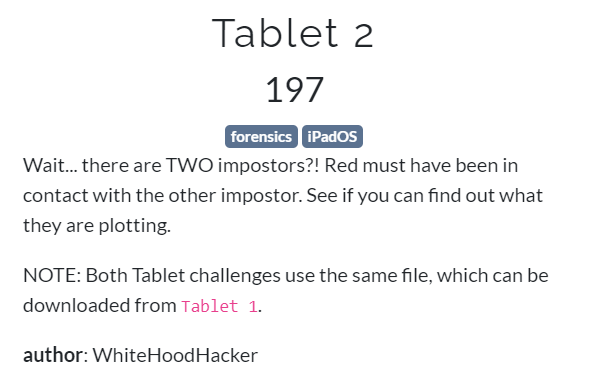

# Challenge Description

This challenge is part of the previous challenge but there are hidden informations
that should be extracted and retrieved according to the description.

# Analysis

My hypotese:
* The perpetrator has some conversation with someone in iOS App
* There's a chance that the App is a `Third Party App`

We can use `iLEAPP` (https://github.com/abrignoni/iLEAPP) for further analysis. There are some keypoints of findings:

